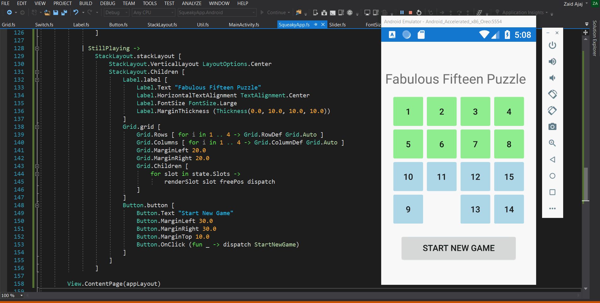
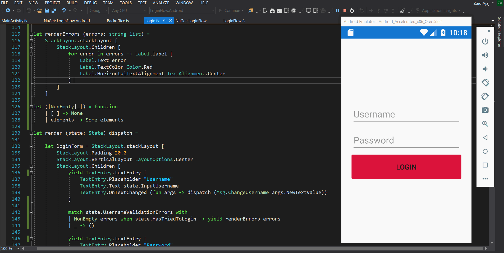
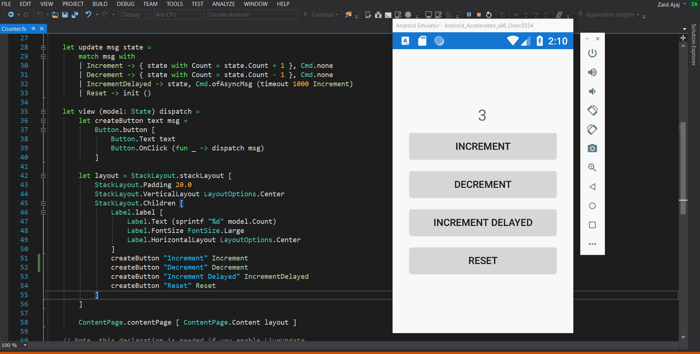

# Fabulous.SimpleElements [](https://www.nuget.org/packages/Fabulous.SimpleElements)   [](https://travis-ci.org/Zaid-Ajaj/fabulous-simple-elements)


An alternative view rendering API for [Fabulous](https://github.com/fsprojects/Fabulous) that is easy to use and simple to read, inspired by Elmish on the web. 

### Install from Nuget
```
dotnet add package Fabulous.SimpleElements	
```
### Usage
The library aims to unify both optional arguments and fluent extension methods for View elements into a list of attributes. This allows for easy API discoverability, just "dotting" through the element module to see what attributes you can set on the element. 
```fs
let view (model: State) dispatch =
    ContentPage.contentPage [
        ContentPage.Title "Page Title"
        ContentPage.Content <|
            StackLayout.stackLayout [
                StackLayout.Padding 20.0 
                StackLayout.VerticalLayout LayoutOptions.Center
                StackLayout.Children [ 
                    Label.label [ 
                        Label.Text "Congrats, you have won!"; 
                        Label.HorizontalTextAlignment TextAlignment.Center
                        Label.MarginLeft 30.0
                        Label.MarginRight 30.0
                        Label.FontSize FontSize.Large 
                    ]
                    Button.button [ 
                        Button.Text "Play Again"
                        Button.OnClick (fun _ -> dispatch StartNewGame) 
                    ]
                ]
            ]
    ]
```
### Backwards compatible with existing DSL 
This DSL is built on-top of the existing one in the core of Fabulous library which means if something isn't implemented here, that use can simply fallback to using the original DSL in a mix-and-match fashion:
```fs
let view (model: State) dispatch =
    View.ContentPage(
        title = "Page Title"
        ,content = StackLayout.stackLayout [ 
            StackLayout.Children [
                View.Button(text="Click me")
            ]
    ])
```
### Extension methods are included with attributes 
Instead of
```fs
View.Button(text="hello")
    .GridColumn(1)
    .GridRow(1)
```
you write
```fs
Button.button [
  Button.Text "Hello"
  Button.GridRow 1
  Button.GridColumn 1
]
```
# Running the samples
Each sample has it's own solution, open any of the samples in Visual Studio or Visual Studio for Mac, select your preferred project to start the app, either `<AppName>.Android` or `<AppName>.iOS` and run the project. 

### Fifteen Puzzle Sample


### LoginFlow sample 


### Counter Sample 

